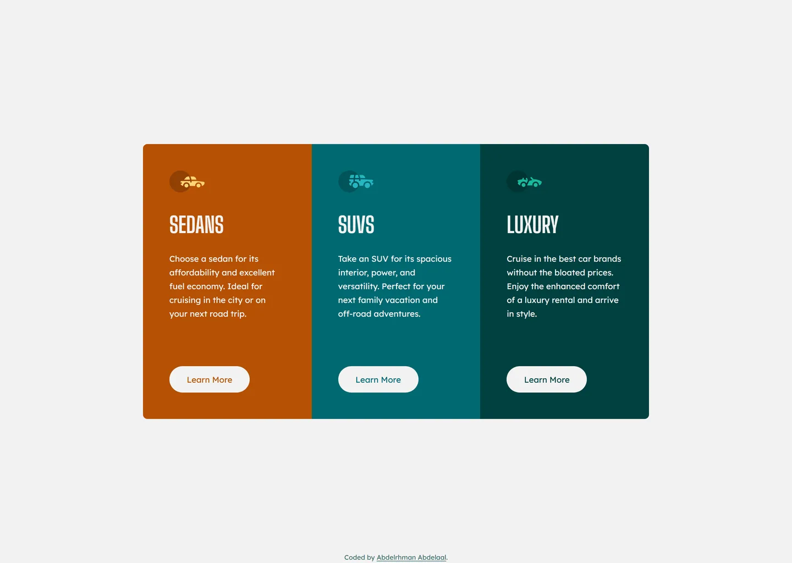

# 3-column preview card component

My solution to the [3-column preview card component](https://www.frontendmentor.io/challenges/3column-preview-card-component-pH92eAR2-) challenge on Frontend Mentor.

- Live: https://3-column-preview-card-component.abdelrhman-ahmed8881.workers.dev
- Code: https://github.com/MrBlackvanta/3-column-preview-card-component

## Built with

- Next.js
- React
- TypeScript
- Tailwind CSS

## Author

- [LinkedIn](https://www.linkedin.com/in/abdelrhman-vanta/)
- [UpWork](https://www.upwork.com/freelancers/mrblackvanta)
- [Frontend Mentor](https://www.frontendmentor.io/profile/MrBlackvanta)
